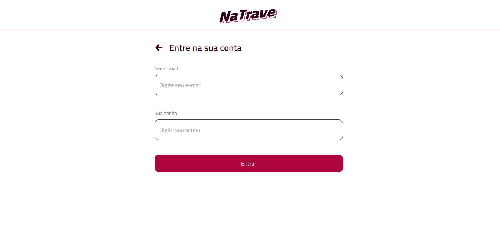
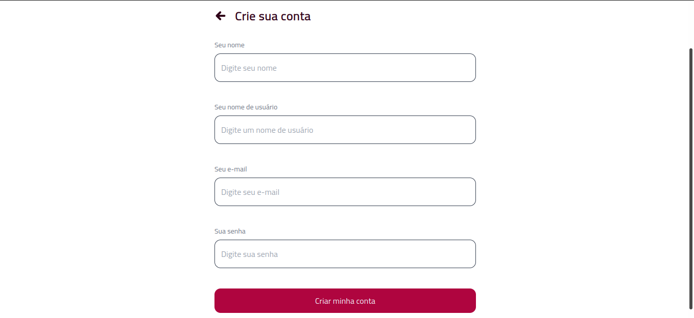
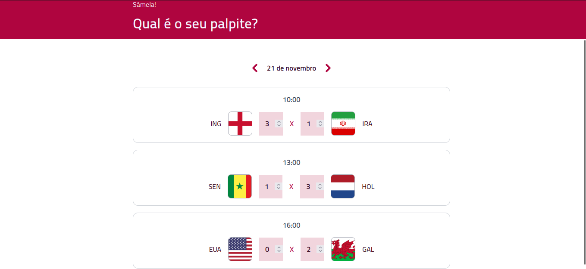

<h1 align="center">naTrave - PalpiteCopa </h1>

  <a href="#-tecnologias">Tecnologias</a>&nbsp;&nbsp;&nbsp;|&nbsp;&nbsp;&nbsp;
  <a href="#-projeto">Projeto</a>&nbsp;&nbsp;&nbsp;|&nbsp;&nbsp;&nbsp;
  <a href="#memo-licença">Licença</a>

  

  

  

  

  

## 🚀 Tecnologias
Este projeto foi desenvolvido com as seguintes tecnologias:

- [React](https://reactjs.org/)
- [Vite](https://vitejs.dev/)
- [Node e NPM](https://nodejs.org/)
- [Tailwindcss](https://tailwindcss.com/)
- [Insomnia](https://insomnia.rest/)
- [PlanetScale](https://planetscale.com/)
- [Prisma](https://www.prisma.io/)

## 💻 Projeto

Aproveitando o ano de Copa do mundo, esta aplicação é um bolão para que o usuário possa registrar seus palpites dos jogos da copa. A aplicação foi de ponta a ponta, foi criado API's para interligar o front com o backEnd utilizando o Nodejs
e o prisma para facilitar a comunicação com o banco de dados do PlanetScale. No front, pude desenvolver todos os componentes com react e ultiliza-los nas paginas conforme a necessidade.
Me ajudou muito a entender como um API funciona e como consumir ela pelo front, é um projeto incrível e com ele pude aprender muito.

## :memo: Licença

Esse projeto está sob a licença MIT.
